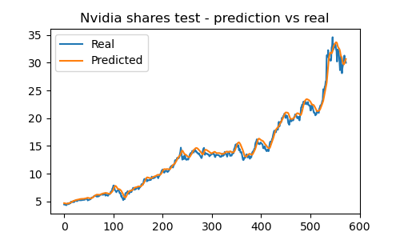
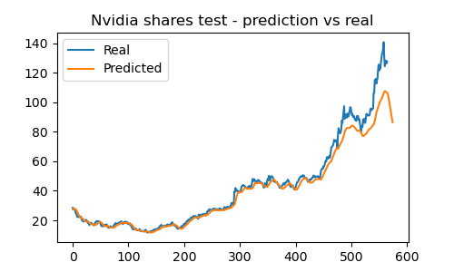
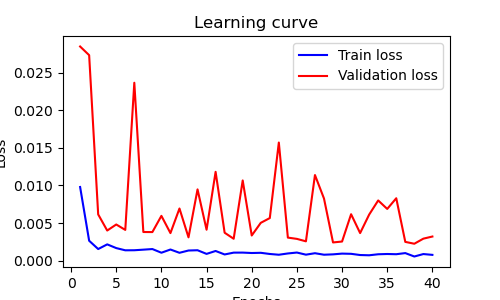

# Predictions on the stock market with LSTM networks (neural networks) in Python
> :loudspeaker: The network and context descriptions were taken from ChatGPT and summarized.

## 1. Resume
In finance, predicting stocks and revenues is essential for investors, enabling informed decisions and better risk management. Traditionally, methods like regressions and annual variance are used. This project focuses on the use of LSTM (Long Short-Term Memory) neural networks, which are advanced RNNs capable of handling long-term dependencies in sequential data.

The objective is to develop an LSTM model to analyze historical stock price data and predict its future behavior. This will provide advanced tools for decision-making, improving the accuracy of financial predictions and optimizing investment management.

## 2. Arquitecture diagram


## 3. Code fragments
Importing necessary libraries  

```python 
import yfinance as yf</br>
import pandas as pd
from sklearn.preprocessing import MinMaxScaler
import numpy as np
from keras.models import Sequential
from keras.layers import Dense, LSTM, Input,Dropout
from keras.optimizers import Adam
```
Importing the historical stock data of the company to be forecasted (in this case, Nvidia)
```python 
msft = yf.Ticker("NVDA")

# get all stock info
msft.info

# get historical market data
hist = msft.history(period="5y")

hist.index = pd.to_datetime(hist.index)
hist.index = hist.index.strftime('%Y-%m-%d')
```
Data visualization
|   Date    |	Open   |   High   |   Low    |   Close  |  Volume   |
| :---      | :---     | :---     |  :---    | :---     | :---      |
|2019-06-17 | 3.593506 | 3.641976 | 3.570638 | 3.604940 | 276040000 |
|2019-06-18 | 3.666335 | 3.855493 | 3.655399 | 3.800063 | 581920000 |
|2019-06-19 | 3.835360 | 3.846794 | 3.779930 | 3.806030 | 331644000 |
|2019-06-20 | 3.896755 | 3.910675 | 3.815971 | 3.830388 | 350168000 |
|2019-06-21 | 3.815474 | 3.864690 | 3.765761 | 3.772224 | 434428000 |
|…          |	…      |   	…	  |…         |	…       |	…       |

<div style='width:100%;display:flex;justify-content:center'></img></div>

Defining X and Y
```python 
set_entrenamiento = hist[:'2022'].iloc[:,1:2]
set_validacion = hist['2022':].iloc[:,1:2]
```

```python 
minmax = MinMaxScaler(feature_range=(0,1))
set_entrenamiento_escalado = minmax.fit_transform(set_entrenamiento)
```
Definition of the model with groups of 60 data points to predict the 61st
```python 
dim_entrada = (X_train.shape[1],1)
dim_salida = 1
na = 100
```

```python 
modelo = Sequential()
modelo.add(Input(shape=dim_entrada))
modelo.add(LSTM(units=na, return_sequences=True))
modelo.add(Dropout(0.2))
# modelo.add(LSTM(units=na, return_sequences=True))
# modelo.add(Dropout(0.3))
modelo.add(LSTM(units=na))
modelo.add(Dropout(0.2))
modelo.add(Dense(units=dim_salida))
modelo.compile(optimizer='rmsprop',loss='mse')
```
Training
```python 
modelo.fit(X_train,Y_train,epochs=40,batch_size=32,validation_data=(X_test,Y_test),verbose=0)
```
## 4. Data visualization
The training set and validation set were predicted; however, this neural network was trained to be more precise on the validation set because it is necessary for it to recognize patterns it did not previously know.
### Gráficas de predicción vs. realidad
<table style="width:100%">
    <tr>
        <td style='text-align:center'><strong>Training set</strong></td>
    <td style='text-align:center'><strong>Validation set</strong></td>
    </tr>
    <tr>
        <td style='width:50%'></img></td>
    <td style='width:50%'></img></td>
    </tr>
</table>
In the case of the validation set, the next 10 days were also predicted by evaluating the previous periods of each, resulting in this case, in a forecast of a decline in value.

### Learning curve
<div style='width:100%;display:flex;justify-content:center'></img></div>